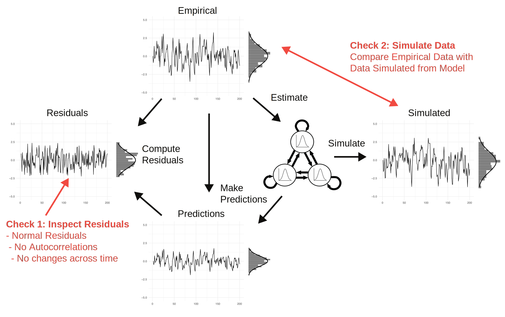

## Modeling Psychological Time Series with Vector Autoregressive Models

Researchers are trying to build dynamic models of the daily functioning of persons with the goal of understanding it and being able to predict the outcomes of interventions. In this context, they need to recover causal effects between variables. When we establish multiple such causal effects among a set of variables, we obtain a dynamic model. [Doing this is very difficult ](https://psycnet.apa.org/fulltext/2022-00806-001.html). However, one reasonable starting point could be to fit the simplest possible multivariate dynamical model directly to empirical data. This model is the Vector Autoregressive model, which in its simplest version models each variable at a given time point as a linear function of all variables including itself at the previous time point. Since the model seems a natural starting point and because software to estimate VAR models is readily available, it has become the most popular model for intensive longitudinal data.


## Why Check the Fit of Your VAR Model?

When reading one of the many published articles reporting on multilevel VAR analyses, you typically only see the group-level effects of the model, usually represented as a directed network. Some studies also report the estimated variability of group-level effects. However, what almost no study reports is how well the VAR model actually fits the data. This is a massive issue for two reasons: First, if the model does not fit the data well, the interpretation of parameters is problematic at the very least and at worst may invalidate the conclusions of the entire analysis. Second, checking model fit and finding model misfit means discovering additional structure in the data that almost always is theoretically interesting.

If model checking is so critical, why is nobody doing it? Most researchers know that they need to do model checks in linear regression, but they don't perform them in the more complicated VAR model. It's a bit like wearing a helmet on your city bike, but taking it off when taking your high-powered motorcycle for a spin. We found out why when trying to implement the model checks ourselves, identifying several practical barriers: First, there is no tutorial that explains the theory and possible diagnostics in the time series setting, which is more complicated than the standard regression context most researchers are familiar with. Second, it turned out to be very difficult to get predictions and residuals out of standard statistical software despite being methodologists ourselves. And third, creating multiple diagnostic plots for many variables and individuals required many hundreds of lines of code which not every researcher is comfortable writing. 

[In our new paper on model checking for VAR models](https://doi.org/10.31234/osf.io/k6uz4_v3), we remove all of these barriers. We provide an accessible tutorial on performing visual model checks on (multilevel) VAR models, a new version of the popular `mlVAR` package that provides predictions and residuals in a single line of code, additional code to get residuals also from DSEM/Mplus, and the new R-package `VARcheck`, which reduces VAR model checks for multiple persons to a single line of R-code.

As a first screening of VAR model fit, we recommend using four diagnostic plots:

1. Visualizing empirical data and model predictions over time. Alongside this, we report $R^2$ and RMSE values to quantify predictability.
2. Visualizing the residuals over time.
3. Plotting residuals versus predicted values. 
4. Comparing the distribution of the data to the distribution of simulated data based on the model parameters.

The below figure explains where different quantities come from. We estimate the VAR model from the empirical data and compute predictions from it. By subtracting the predictions from the empirical data we obtain residuals. And we can use the fitted VAR model to generate new data which we can compare with the empirical data. We introduce the basic theory behind VAR model checking and motivate these particular visual checks [in our paper](https://doi.org/10.31234/osf.io/k6uz4_v3).

{fig-align="center" width="95%"}

To make the model checking workflow as simple as possible, we extended existing software and developed new software. Sacha Epskamp created a new version of the R-package [mlVAR](https://cran.r-project.org/web/packages/mlVAR/index.html) which now includes functions to easily extract predictions and residuals. Joran Jongerling also [created a pipeline](https://github.com/jmbh/ModelCheckingForVAR) for getting predictions and residuals out of DSEM/Mplus. And we created the new R-package [`VARcheck`](https://bsiepe.github.io/VARcheck/), which provides a set of functions to conduct the model checking procedure described in the paper.^[Only after publishing the package, a football enthusiast made us aware of the widespread use of the term "VAR check" in football. We hope our procedure becomes equally universal, if slightly less controversial.] 

In this blog post we describe a brief walkthrough of how to fit a standard multilevel VAR model with mlVAR and use its new functionality and the new R-package `VARcheck` to perform extensive model checks with only a few lines of code.

## Preparing Packages & Data

As in the paper, we use data by [Grommisch et al.](https://doi.org/10.1037/emo0000669) who investigated individual differences in the use of emotion regulation strategies in daily life. The dataset is available on [openESM](https://openesmdata.org/datasets/0032_grommisch/) and can be easily loaded with the `openesm` package.


```{r}
#| message: false
#| warning: false
library(openesm)
library(VARcheck)
library(devtools)
library(mlVAR)
library(qgraph)

# For preprocessing
library(plyr)
library(tidyr)
library(dplyr)

# load data
data <- openesm::get_dataset("0032_grommisch", version = "1.0.0")$data

```

In the background, we conduct some light preprocessing of the data, which is described in the paper and in the [raw code](https://github.com/bsiepe/bsiepe.github.io/blog) of this blog post. Specifically, we add missing values for missed timepoints, as these are missing only implicitly in the current dataset. We include those to retain the actual sequence of time points in the diagnostic plots.

```{r}
#| eval: true
#| echo: false

# preprocess data as in the paper

# -------- Subset Data ---------------------

data_ss <- data[, c("id", "counter", "day", "happy", "relaxed", "sad", "angry")]

# we rename counter to beep to align it with the paper's supplement
data_ss <- data_ss |> rename(beep = counter)


# -------- Recode the Beep Variable --------
data_ss2 <- ddply(data_ss, .(id, day), function(x) {
  x$beep <- x$beep - min(x$beep) + 1
  return(x)
})

# ------------------------------------------
# -------- Add NAs for Missing Values ------
# ------------------------------------------
# This is especially useful for plotting the data, because then one sees the missing data

data_ss3 <- ddply(data_ss2, .(id, day), function(x) {

  df_full <- data.frame(matrix(NA, 10, 7))
  # Loop through measurements, fill in NA, where missing
  for(i in 1:10) {
    if(i %in% x$beep) {
      df_full[i, ] <- x[x$beep==i, ]
    } else {
      df_full[i, ] <- c(NA, i, rep(NA, 5))
    }
  }
  # Fill up id variables
  df_full$X1 <- unique(df_full$X1[!is.na(df_full$X1)])
  df_full$X2 <- unique(df_full$X2[!is.na(df_full$X2)])
  return(df_full)
})
data_ss4 <- data_ss3[, -(1:2)]
colnames(data_ss4) <- colnames(data_ss)

data_clean <- data_ss4
```


## VAR Model Estimation

We use the `mlVAR` package to estimate a multilevel VAR model, and `qgraph` to visualize the results. 

```{r}
#| message: false
mlVAR_out <- mlVAR(data = data_clean,
                   vars = colnames(data_clean)[4:7],
                   idvar = colnames(data_clean)[1],
                   lags = 1,
                   dayvar = colnames(data_clean)[3],
                   beepvar = colnames(data_clean)[2],
                   contemporaneous = "correlated",
                   temporal = "correlated",
                   scale = TRUE,
                   verbose = FALSE)
```

These are the group-level estimates for the temporal network, and their standard deviation across individuals: 

```{r}
#| message: false
#| fig-align: "center"
#| fig-width: 9
#| fig-height: 6
# column names
capitalize_first <- function(x) paste0(toupper(substring(x, 1, 1)), substring(x, 2))
col_labels <- capitalize_first(colnames(data_clean)[4:7])

# some parameters for plotting
sc <- 2
sc_2 <- 0.6
title_cex <- 1.1

par(mfrow=c(1,2), oma=c(0,0,2,0))

# Network
qgraph(
  t(mlVAR_out$results$Beta$mean[, , 1]),
  # Note: In the input matrix columns predict rows; but qgraph() plots it the other way around, so we have to transpose
  layout = "circle",
  labels = col_labels,
  vsize = 18 * sc_2,
  esize = 12 * sc_2,
  asize = 10 * sc_2,
  edge.labels = TRUE,
  edge.label.cex = 1.5,
  fade = F,
  mar = rep(7, 4),
  palette = "colorblind",
  theme = "colorblind",
  title = "Fixed Effects Estimates",
  title.cex = title_cex
)

# Network
qgraph(
  t(mlVAR_out$results$Beta$SD[, , 1]),
  layout = "circle",
  labels = col_labels,
  vsize = 18 * sc_2,
  esize = 12 * sc_2,
  asize = 10 * sc_2,
  edge.labels = TRUE,
  edge.label.cex = 1.5,
  fade = F,
  mar = rep(7, 4),
  edge.color = "grey",
  palette = "colorblind",
  theme = "colorblind",
  title = "Random Effects SDs",
  title.cex = title_cex
)
```

The left network shows the group-level effects of the fitted VAR model. We see that all variables have relatively strong positive autocorrelations. Cross-lagged effects are a bit smaller in absolute value and positive between emotion measurements with the same valence, and negative between emotion measurements with a different valence. [This is a general pattern](https://psycnet.apa.org/fulltext/2025-60391-001.html) one finds in most VAR networks of affective variables. The right network shows the variability (as a standard deviation) in these parameters across persons.

In most published papers, the modeling process ends here after a description of these networks. Here we continue with checking how well the VAR model actually fits the data.

## Checking VAR Model Fit

To check the model fit visually, we first need to obtain predicted values, residuals, and simulated data based on the parameters of the VAR model. The new version of `mlVAR` provides helper functions that make this very easy:

```{r}
#| message: false
pred_df <- predict(mlVAR_out)
res_df  <- residuals(mlVAR_out)
sim_df <- resimulate(mlVAR_out, keep_missing = TRUE,
                              variance = "empirical")
```

We can then pass these objects to `new_var_data()`, one of the two main functions of `VARcheck`, which takes three required inputs (empirical data, model predictions, and residuals), each as a $T \times p$ numeric matrix (time points × variables). Simulated data for posterior predictive checks is optional but enables the rightmost column of the diagnostic grid. This means that `VARcheck` can be used with any VAR model as long as the empirical data, model predictions, and residuals are available in the required format.

Here, we only use data of a single individual for demonstration purposes, but the same procedure can be (and should be) applied to all individuals in the dataset. See our [package documentation](https://bsiepe.github.io/VARcheck/articles/getting-started.html#using-mlvar-outputs) for more information. We choose individual 33 for demonstration purposes. 

```{r}
all_ids <- unique(data_clean$id)
demonstration_id <- all_ids[33]

# get data by individual in matrix form 
data_matrix_demonstration <- as.matrix(data_clean[data_clean$id == demonstration_id, colnames(data_clean)[4:7]])

# select only the variables that were included in the model
vd <- new_var_data(
  empirical  = data_matrix_demonstration,
  predicted  = as.matrix(pred_df[pred_df$id == demonstration_id, colnames(data_clean)[4:7]]),
  residuals  = as.matrix(res_df[res_df$id == demonstration_id, colnames(data_clean)[4:7]]),
  simulated  = as.matrix(sim_df[sim_df$id == demonstration_id, colnames(data_clean)[4:7]]),
  var_names  = col_labels
)
```

We then use `plot_var_check()` to plot the diagnostic grid:

```{r}
#| warning: false
#| fig-width: 9
#| fig-height: 9
plot_var_check(vd)
```

Starting with the first row (for the variable Happy), we can see frequent switching behavior between states around 25 and 75. As a consequence, collapsing the observations across time (on the right-hand side of the first column of plots) leads to a bimodal distribution. The predictions are far off the observations, which is reflected by an $R^2$ close to zero and a relatively large RMSE of 22. 

In the next column, the residuals look similar to the data, only a bit less bimodal. The next plot, showing residuals as a function of predictions, again shows the bimodality of the residuals we have already seen in the second plot. If the VAR model fit well we would expect a Gaussian distribution and the bimodal residuals therefore indicate model misfit. The third column plotting residuals against predictions shows us again the bimodality of the residuals. The final column shows the simulated time series of Happy from the overall VAR model. We see that the time series looks very different and does not show the bimodal distribution of the empirical data, which again indicates model misfit.

Inspecting the diagnostic plots for the remaining variables Relaxed, Sad, and Angry leads us to similar conclusions. The distributions of the data and the residuals are all bimodal. The main characteristic of the time series of Person 33 is the frequent switching between states and the implied bimodality in distributions. This is a dynamic the VAR model cannot capture and the model is therefore strongly misspecified for these data. For this individual, we could therefore not interpret the parameters of the VAR model in a meaningful way and would have to consider alternative models that can capture this type of switching behavior such as regime switching models.


## Where do you go from here?

In practice, one would inspect the diagnostic plots for all persons and one might find that the model does not fit the data for a subset of persons, perhaps for different reasons. What to do then? Of course, there cannot be a simple answer. That would be like asking a mechanic for one universal fix for every car that makes a strange noise. What is a good way forward will depend on the goals and the context of the study at hand. That said, in our paper, we discuss some of the things one might want to think about when deciding what to do next:

1. **Improve measurement**: Some forms of misfit, such as bimodality, might be (partially) induced by measurement. Using different items, response scales, or instructions might help to reduce these types of problems. After removing such measurement artifacts, it is easier to model the latent dynamics most researchers are primarily interested in.

2. **Embrace model building**: There are many flexible modeling frameworks that can allow for extensions of VAR-type models to capture more complex structure in time series data. But there are also other modeling frameworks, such as state-switching Hidden Markov Models. If your model does not fit the data well, the analysis of the precise nature of the misfit might point you in the direction of one of those extensions or alternative models.

3. **Theory development**: Much of the current time series modeling is based on the premise that we can estimate a believable and useful dynamic model directly from one single dataset. However, [how realistic is this](https://www.tandfonline.com/doi/full/10.1080/00273171.2021.1896353) given the many complexities about human functioning? Developing formal theories (or computational models) provides a more flexible approach that allows one to [integrate different data sources](https://www.tandfonline.com/doi/full/10.1080/00273171.2024.2336178). Such a framework of course also makes use of time series data, but not to estimate the model in one shot, but rather to test specific predictions the computational model makes about specific time series data.

If you try `VARcheck` on your own data, we'd be curious what you find, especially if the model fits poorly in ways we haven't discussed here. So feel free to reach out!

## Computational Details

These are the packages and versions used in this blog post: 

```{r}
#| eval: true
#| echo: false
pander::pander(sessionInfo())
```
