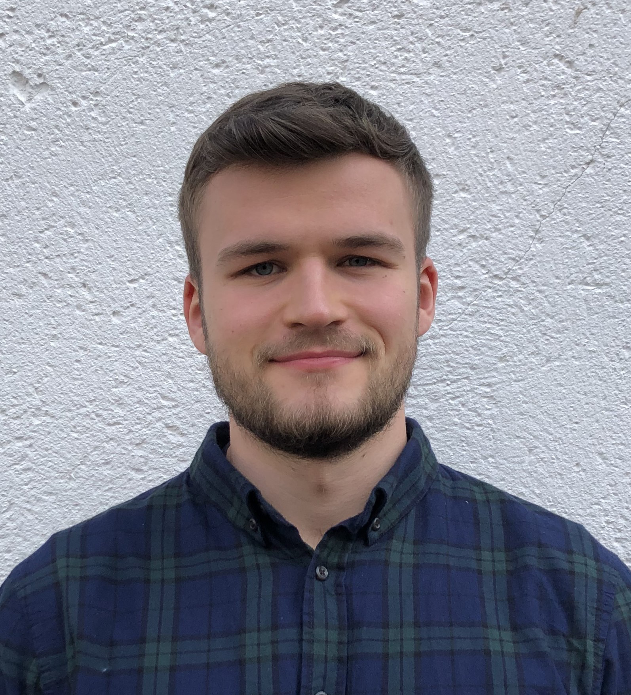

<!-- ::: {.grid} -->

<!-- ::: {.g-col-12 .g-col-md-3} -->

<!-- {width=100% fig-alt="An image of Björn Siepe"} -->

<!-- :::  -->

<!-- ::: {.g-col-12 .g-col-md-9} -->

<!-- My name is Björn Siepe, and I am a PhD student in Psychological Methods at -->

<!-- the [University of Marburg, Germany](https://www.uni-marburg.de/de/fb04/team-heck/team/bjoern-siepe).  -->

<!-- In my methodological work, I study uncertainty in psychological time series analysis, network models, and predictive modelling. I'm also interested in using longitudinal and passive sensor data to better understand and predict mental disorders.  -->

<!-- I am passionate about the open science movement and have been actively involved in the local open science groups in Frankfurt and Marburg. I have been involved in (co-)hosting multiple recurring events, such as the [ReproducibiliTea](https://frankfurt-osi.netlify.app/top/reproducibilitea/) journal club or [Brainhack School](https://openscienceinitiativeuniversitymarburg.github.io/). If possible, I publish all my projects with open data and code. -->

<!-- To find all my publications and talks, take a look at my [CV](../cv). -->

<!-- ::: -->

<!-- ::: -->

```{css, echo = FALSE}
.justify {
  text-align: justify !important
}
```

::: justify
I am a Doctoral student in Psychological Methods at [Marburg University, Germany](https://www.uni-marburg.de/de/fb04/team-heck/team/bjoern-siepe). <br> My research focuses on three areas: metascience of methodological research, time series modelling, and applied experience sampling research. I'm interested in understanding how we can make methodological research more robust and transparent, and how we can better model intensive longitudinal data.

I'm committed to open science practices. Together with collaborators, I built [openESM](https://openesmdata.org), an open-source database of 60+ experience sampling datasets. I'm also a board member of the [Open Science Initiative](https://openscienceinitiativeuniversitymarburg.github.io/) at Marburg University. <br>

Feel free to browse my [publications](../publications), [software](../software), or [CV](../cv), or [contact me](mailto:bjoernsiepe@gmail.com) directly.
:::